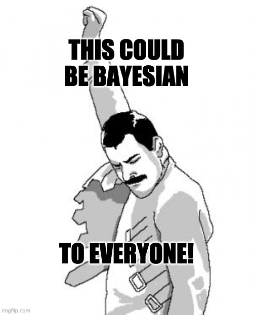

# Bayesian Statistics

Bayesian for Everyone!

This repository holds slides and code for a full Bayesian statistics graduate course.

**Bayesian statistics** is an approach to inferential statistics based on Bayes' theorem,
where available knowledge about parameters in a statistical model is updated with the information in observed data.
The background knowledge is expressed as a prior distribution and combined with observational data in the form of a likelihood function to determine the posterior distribution.
The posterior can also be used for making predictions about future events.

**Bayesian statistics** is a departure from classical inferential statistics that prohibits probability statements about parameters and is based on asymptotically sampling infinite samples from a theoretical population and finding parameter values that maximize the likelihood function.
Mostly notorious is null-hypothesis significance testing (NHST) based on _p_-values.
Bayesian statistics **incorporate uncertainty** (and prior knowledge) by allowing probability statements about parameters,
and the process of parameter value inference is a direct result of the **Bayes' theorem**.

## Content

The whole content is a set of several slides found at [`the latest release`](https://github.com/storopoli/Bayesian-Statistics/releases/latest/download/slides.pdf) (348 slides).
Here is a brief table of contents:

1. **What is Bayesian Statistics?**
2. **Common Probability Distributions**
3. **Priors**
4. **Predictive Checks**
5. **Bayesian Linear Regression**
6. **Bayesian Logistic Regression**
7. **Bayesian Ordinal Regression**
8. **Bayesian Regression with Count Data: Poisson Regression**
9. **Robust Bayesian Regression**
10. **Hierarchical Models**
11. **Markov Chain Monte Carlo (MCMC) and Model Metrics**
12. **Model Comparison: Cross-Validation and Other Metrics**

## Probabilistic Programming Languages (PPLs)

Along with slides for the content, this repository also holds `Stan` code and also `Turing.jl` code for all models.
`Stan` and `Turing.jl` represents, respectively, the present and future of [probabilistic programming](https://en.wikipedia.org/wiki/Probabilistic_programming) languages.

### `Stan`

[**`Stan`**](https://mc-stan.org) (Carpenter et al., 2017) `Stan` is a state-of-the-art platform for statistical modeling and high-performance statistical computation.
Thousands of users rely on `Stan` for statistical modeling, data analysis, and prediction in the social, biological, and physical sciences, engineering, and business.

`Stan` models are specified in its own language (similar to C++) and compiled into an executable binary that can generate Bayesian statistical inferences using a high-performance Markov Chain Montecarlo (MCMC).

You can find `Stan` models for all the content discussed in the slides at [`stan/`](stan/) folder.
These were tested with `Stan` version 2.30.0 and `CmdStanR` version 0.5.2.

### `Turing.jl`

[**`Turing.jl`**](http://turing.ml/) (Ge, Xu & Ghahramani, 2018) is an ecosystem of [**Julia**](https://www.julialang.org) packages for Bayesian Inference using [probabilistic programming](https://en.wikipedia.org/wiki/Probabilistic_programming).
Models specified using `Turing.jl` are easy to read and write — models work the way you write them.
Like everything in Julia, `Turing.jl` is [fast](https://arxiv.org/abs/2002.02702).

You can find `Turing.jl` models for all the content discussed in the slides at [`turing/`](turing/) folder.
These were tested with `Turing.jl` version 0.21.9 and Julia 1.7.3.

## Datasets

- `kidiq` (linear regression): data from a survey of adult American women and their children
  (a subsample from the National Longitudinal Survey of Youth).
  Source: Gelman and Hill (2007).
- `wells` (logistic regression): a survey of 3200 residents in a small area of Bangladesh suffering
  from arsenic contamination of groundwater.
  Respondents with elevated arsenic levels in their wells had been encouraged to switch their water source
  to a safe public or private well in the nearby area
  and the survey was conducted several years later to
  learn which of the affected residents had switched wells.
  Source: Gelman and Hill (2007).
- `esoph` (ordinal regression): data from a case-control study of (o)esophageal cancer in Ille-et-Vilaine, France.
  Source: Breslow and Day (1980).
- `roaches` (Poisson regression): data on the efficacy of a pest management system at reducing the number of roaches in urban apartments.
  Source: Gelman and Hill (2007).
- `duncan` (robust regression): data from occupation's prestige filled with outliers.
  Source: Duncan (1961).
- `cheese` (hierarchical models): data from cheese ratings.
  A group of 10 rural and 10 urban raters rated 4 types of different cheeses (A, B, C and D) in two samples.
  Source: Boatwright, McCulloch and Rossi (1999).

## Author

Jose Storopoli, PhD - [_Lattes_ CV](http://lattes.cnpq.br/2281909649311607) - [ORCID](https://orcid.org/0000-0002-0559-5176) - <https://storopoli.io>

## How to use the content?

The content is licensed under a very permissive Creative Commons license (CC BY-SA).
You are mostly welcome to contribute with [issues](https://www.github.com/storopoli/Bayesian-Statistics/issues)
and [pull requests](https://github.com/storopoli/Bayesian-Statistics/pulls).
My hope is to have **more people into Bayesian statistics**.
The content is aimed towards PhD candidates in applied sciences.
I chose to provide an **intuitive approach** along with some rigorous mathematical formulations.
I've made it to be how I would have liked to be introduced to Bayesian statistics.

## References

The references are divided in **books**, **papers**, **software**, and **datasets**.

### Books

- Gelman, A., Carlin, J. B., Stern, H. S., Dunson, D. B., Vehtari, A.,
  & Rubin, D. B. (2013). _Bayesian Data Analysis_. Chapman and
  Hall/CRC.
- McElreath, R. (2020). _Statistical rethinking: A Bayesian course
  with examples in R and Stan_. CRC press.
- Gelman, A., Hill, J., & Vehtari, A. (2020). _Regression and other
  stories_. Cambridge University Press.
- Brooks, S., Gelman, A., Jones, G., & Meng, X.-L. (2011). _Handbook
  of Markov Chain Monte Carlo_. CRC Press.
  <http://books.google.com?id=qfRsAIKZ4rIC>
  - Geyer, C. J. (2011). Introduction to markov chain monte carlo.
    In S. Brooks, A. Gelman, G. L. Jones, & X.-L. Meng (Eds.),
    _Handbook of markov chain monte carlo_.

### Papers

The papers section of the references are divided into **required** and **complementary**.

#### Required

- van de Schoot, R., Depaoli, S., King, R., Kramer, B., Märtens, K.,
  Tadesse, M. G., Vannucci, M., Gelman, A., Veen, D., Willemsen, J., &
  Yau, C. (2021). Bayesian statistics and modelling. _Nature Reviews
  Methods Primers_, _1_(1, 1), 1–26.
  https://doi.org/[10.1038/s43586-020-00001-2](https://doi.org/10.1038/s43586-020-00001-2)
- Gabry, J., Simpson, D., Vehtari, A., Betancourt, M., & Gelman, A.
  (2019). Visualization in Bayesian workflow. _Journal of the Royal
  Statistical Society: Series A (Statistics in Society)_, _182_(2),
  389–402.
  https://doi.org/[10.1111/rssa.12378](https://doi.org/10.1111/rssa.12378)
- Gelman, A., Vehtari, A., Simpson, D., Margossian, C. C., Carpenter,
  B., Yao, Y., Kennedy, L., Gabry, J., Bürkner, P.-C., & Modr’ak, M.
  (2020, November 3). _Bayesian Workflow_.
  <http://arxiv.org/abs/2011.01808>
- Benjamin, D. J., Berger, J. O., Johannesson, M., Nosek, B. A.,
  Wagenmakers, E.-J., Berk, R., Bollen, K. A., Brembs, B., Brown, L.,
  Camerer, C., Cesarini, D., Chambers, C. D., Clyde, M., Cook, T. D.,
  De Boeck, P., Dienes, Z., Dreber, A., Easwaran, K., Efferson, C., …
  Johnson, V. E. (2018). Redefine statistical significance. _Nature
  Human Behaviour_, _2_(1), 6–10.
  https://doi.org/[10.1038/s41562-017-0189-z](https://doi.org/10.1038/s41562-017-0189-z)
- Etz, A. (2018). Introduction to the Concept of Likelihood and Its
  Applications. _Advances in Methods and Practices in Psychological
  Science_, _1_(1), 60–69.
  https://doi.org/[10.1177/2515245917744314](https://doi.org/10.1177/2515245917744314)
- Etz, A., Gronau, Q. F., Dablander, F., Edelsbrunner, P. A., &
  Baribault, B. (2018). How to become a Bayesian in eight easy steps:
  An annotated reading list. _Psychonomic Bulletin & Review_, _25_(1),
  219–234.
  https://doi.org/[10.3758/s13423-017-1317-5](https://doi.org/10.3758/s13423-017-1317-5)
- McShane, B. B., Gal, D., Gelman, A., Robert, C., & Tackett, J. L.
  (2019). Abandon Statistical Significance. _American Statistician_,
  _73_, 235–245.
  https://doi.org/[10.1080/00031305.2018.1527253](https://doi.org/10.1080/00031305.2018.1527253)
- Amrhein, V., Greenland, S., & McShane, B. (2019). Scientists rise up
  against statistical significance. _Nature_, _567_(7748), 305–307.
  https://doi.org/[10.1038/d41586-019-00857-9](https://doi.org/10.1038/d41586-019-00857-9)
- van Ravenzwaaij, D., Cassey, P., & Brown, S. D. (2018). A simple
  introduction to Markov Chain Monte–Carlo sampling. _Psychonomic
  Bulletin and Review_, _25_(1), 143–154.
  https://doi.org/[10.3758/s13423-016-1015-8](https://doi.org/10.3758/s13423-016-1015-8)
- Vandekerckhove, J., Matzke, D., Wagenmakers, E.-J., & others.
  (2015). Model comparison and the principle of parsimony. In J. R.
  Busemeyer, Z. Wang, J. T. Townsend, & A. Eidels (Eds.), _Oxford
  handbook of computational and mathematical psychology_ (pp.
  300–319). Oxford University Press Oxford.
- van de Schoot, R., Kaplan, D., Denissen, J., Asendorpf, J. B.,
  Neyer, F. J., & van Aken, M. A. G. (2014). A Gentle Introduction to
  Bayesian Analysis: Applications to Developmental Research. _Child
  Development_, _85_(3), 842–860.
  https://doi.org/[10.1111/cdev.12169](https://doi.org/10.1111/cdev.12169)
  \_eprint:
  https://srcd.onlinelibrary.wiley.com/doi/pdf/10.1111/cdev.12169
- Wagenmakers, E.-J. (2007). A practical solution to the pervasive
  problems of p values. _Psychonomic Bulletin & Review_, _14_(5),
  779–804.
  https://doi.org/[10.3758/BF03194105](https://doi.org/10.3758/BF03194105)
- Vandekerckhove, J., Matzke, D., Wagenmakers, E.-J., & others. (2015).
  Model comparison and the principle of parsimony.
  In J. R. Busemeyer, Z. Wang, J. T. Townsend, & A. Eidels (Eds.),
  Oxford handbook of computational and mathematical psychology (pp. 300–319).
  Oxford University Press Oxford.
- Vehtari, A., Gelman, A., & Gabry, J. (2015). Practical Bayesian model evaluation
  using leave-one-out cross-validation and WAIC.
  https://doi.org/10.1007/s11222-016-9696-4

#### Complementary

- Cohen, J. (1994). The earth is round (p &lt; .05). _American
  Psychologist_, _49_(12), 997–1003.
  https://doi.org/[10.1037/0003-066X.49.12.997](https://doi.org/10.1037/0003-066X.49.12.997)
- Dienes, Z. (2011). Bayesian Versus Orthodox Statistics: Which Side
  Are You On? _Perspectives on Psychological Science_, _6_(3),
  274–290.
  https://doi.org/[10.1177/1745691611406920](https://doi.org/10.1177/1745691611406920)
- Etz, A., & Vandekerckhove, J. (2018). Introduction to Bayesian
  Inference for Psychology. _Psychonomic Bulletin & Review_, _25_(1),
  5–34.
  https://doi.org/[10.3758/s13423-017-1262-3](https://doi.org/10.3758/s13423-017-1262-3)
- J’unior, C. A. M. (2020). Quanto vale o valor-p? _Arquivos de
  Ciências Do Esporte_, _7_(2).
- Kerr, N. L. (1998). HARKing: Hypothesizing after the results are
  known. _Personality and Social Psychology Review_, _2_(3), 196–217.
  https://doi.org/[10.1207/s15327957pspr0203\_4](https://doi.org/10.1207/s15327957pspr0203_4)
- Kruschke, J. K., & Vanpaemel, W. (2015). Bayesian estimation in
  hierarchical models. In J. R. Busemeyer, Z. Wang, J. T. Townsend,
  & A. Eidels (Eds.), _The Oxford handbook of computational and
  mathematical psychology_ (pp. 279–299). Oxford University Press
  Oxford, UK.
- Kruschke, J. K., & Liddell, T. M. (2018). Bayesian data analysis for
  newcomers. _Psychonomic Bulletin & Review_, _25_(1), 155–177.
  https://doi.org/[10.3758/s13423-017-1272-1](https://doi.org/10.3758/s13423-017-1272-1)
- Kruschke, J. K., & Liddell, T. M. (2018). The Bayesian New
  Statistics: Hypothesis testing, estimation, meta-analysis, and power
  analysis from a Bayesian perspective. _Psychonomic Bulletin &
  Review_, _25_(1), 178–206.
  https://doi.org/[10.3758/s13423-016-1221-4](https://doi.org/10.3758/s13423-016-1221-4)
- Lakens, D., Adolfi, F. G., Albers, C. J., Anvari, F., Apps, M. A.
  J., Argamon, S. E., Baguley, T., Becker, R. B., Benning, S. D.,
  Bradford, D. E., Buchanan, E. M., Caldwell, A. R., Van Calster, B.,
  Carlsson, R., Chen, S. C., Chung, B., Colling, L. J., Collins, G.
  S., Crook, Z., … Zwaan, R. A. (2018). Justify your alpha. _Nature
  Human Behaviour_, _2_(3), 168–171.
  https://doi.org/[10.1038/s41562-018-0311-x](https://doi.org/10.1038/s41562-018-0311-x)
- Morey, R. D., Hoekstra, R., Rouder, J. N., Lee, M. D., &
  Wagenmakers, E.-J. (2016). The fallacy of
  placing confidence in confidence intervals. _Psychonomic
  Bulletin & Review_, _23_(1), 103–123.
  https://doi.org/[10.3758/s13423-015-0947-8](https://doi.org/10.3758/s13423-015-0947-8)
- Murphy, K. R., & Aguinis, H. (2019). HARKing: How Badly Can
  Cherry-Picking and Question Trolling Produce Bias in Published
  Results? _Journal of Business and Psychology_, _34_(1).
  https://doi.org/[10.1007/s10869-017-9524-7](https://doi.org/10.1007/s10869-017-9524-7)
- Stark, P. B., & Saltelli, A. (2018). Cargo-cult statistics and
  scientific crisis. _Significance_, _15_(4), 40–43.
  https://doi.org/[10.1111/j.1740-9713.2018.01174.x](https://doi.org/10.1111/j.1740-9713.2018.01174.x)

### Software

- Carpenter, B., Gelman, A., Hoffman, M. D., Lee, D., Goodrich, B.,
  Betancourt, M., Brubaker, M., Guo, J., Li, P., & Riddell, A. (2017).
  Stan : A Probabilistic Programming Language. _Journal of Statistical
  Software_, _76_(1).
  https://doi.org/[10.18637/jss.v076.i01](https://doi.org/10.18637/jss.v076.i01)
- Ge, H., Xu, K., & Ghahramani, Z. (2018). Turing: A Language for Flexible Probabilistic Inference. International Conference on Artificial Intelligence and Statistics, 1682–1690. http://proceedings.mlr.press/v84/ge18b.html
- Tarek, M., Xu, K., Trapp, M., Ge, H., & Ghahramani, Z. (2020). DynamicPPL: Stan-like Speed for Dynamic Probabilistic Models. ArXiv:2002.02702 [Cs, Stat]. http://arxiv.org/abs/2002.02702
- Xu, K., Ge, H., Tebbutt, W., Tarek, M., Trapp, M., & Ghahramani, Z. (2020). AdvancedHMC.jl: A robust, modular and efficient implementation of advanced HMC algorithms. Symposium on Advances in Approximate Bayesian Inference, 1–10. http://proceedings.mlr.press/v118/xu20a.html

### Datasets

- Boatwright, P., McCulloch, R., & Rossi, P. (1999). Account-level modeling for trade promotion: An application of a constrained parameter hierarchical model. _Journal of the American Statistical Association_, 94(448), 1063–1073.
- Breslow, N. E. & Day, N. E. (1980). **Statistical Methods in Cancer Research. Volume 1: The Analysis of Case-Control Studies**. IARC Lyon / Oxford University Press.
- Duncan, O. D. (1961). A socioeconomic index for all occupations. Class: Critical Concepts, 1, 388–426.
- Gelman, A., & Hill, J. (2007). **Data analysis using regression and
  multilevel/hierarchical models**. Cambridge university press.

## How to cite

To cite this course, please use:

    Storopoli (2022). Bayesian Statistics: a graduate course. https://github.com/storopoli/Bayesian-Statistics.

Or in BibTeX format (LaTeX):

    @misc{storopoli2022bayesian,
      author = {Storopoli, Jose},
      title = {Bayesian Statistics: a graduate course},
      url = {https://github.com/storopoli/Bayesian-Statistics},
      year = {2022}
    }

## License

This content is licensed under [Creative Commons Attribution-ShareAlike 4.0 International](http://creativecommons.org/licenses/by-sa/4.0/).

